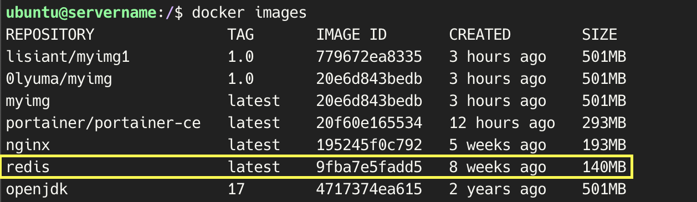
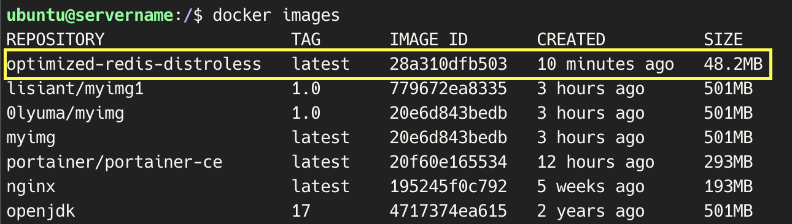

# 🐳 Docker Image 관련 실습 및 정리

## 📊 Docker Image 최적화
### 1. Minimal Base Images 사용하기  

Alpine Linux를 기반으로 Java 애플리케이션을 Docker 컨테이너에서 실행하였습니다.  

```docker
# 1. Alpine을 베이스 이미지로 설정 (OpenJDK 포함된 버전 사용)
FROM openjdk:17-alpine

# 2. JAR 파일을 컨테이너로 복사
COPY target/myapp.jar /app/myapp.jar

# 3. 작업 디렉토리 설정
WORKDIR /app

# 4. 애플리케이션 실행 명령어 설정
CMD ["java", "-jar", "myapp.jar"]
```

Java는 JVM을 필요로 하므로, Alpine 이미지를 사용하면서 JDK를 설치하고 Java 애플리케이션을 실행할 수 있습니다.


```bash
docker build -t my-java-app .
docker run -it --rm my-java-app
```
Dockerfile을 이용하여 Docker Image를 빌드하고 컨테이너를 실행하였습니다.  

💡 **추가 설정**
1. 환경 변수 설정
```docker
ENV JAVA_OPTS="-Xms512m -Xmx1024m"

CMD ["java", "$JAVA_OPTS", "-jar", "myapp.jar"]
```
Java 애플리케이션의 메모리 설정을 환경 변수로 지정할 수 있습니다.  

2. JRE 설치하여 더 가볍게 만들기
```docker
FROM openjdk:17-jre-alpine
COPY target/myapp.jar /app/myapp.jar
WORKDIR /app
CMD ["java", "-jar", "myapp.jar"]
```

Alpine은 가벼운 이미지지만, 필요하지 않은 프로그램이 포함되어 있을 수 있습니다. 반면에 Distroless는 애플리케이션 실행에 필요한 것만 포함하므로 보안과 효율성 면에서 더 나은 선택이 될 수 있습니다.

**Distroless** 사용한 예시
```docker
# 1단계: 빌드 단계
FROM openjdk:11 AS builder

# 작업 디렉토리 설정
WORKDIR /app

# 소스 코드 복사
COPY . .

# 애플리케이션 컴파일
RUN javac Main.java

# 2단계: Distroless 이미지로 복사
FROM gcr.io/distroless/java

# 빌드 단계에서 컴파일된 파일 복사
COPY --from=builder /app/Main.class /app/Main.class

# 실행할 명령어 설정
CMD ["Main"]
```

### 2. Single Responsibility Principle
각 Docker 이미지는 단일 책임을 가져야 하며, 하나의 역할이나 기능만 수행해야 합니다. 여러 가지 서비스를 하나의 이미지로 묶는 대신, 각 서비스를 개별적인 이미지로 분리하고 이를 Docker Compose나 Kubernetes 같은 도구를 사용하여 서로 연결하는 방식으로 구성해야 합니다.  

💡 **Docker Compose를 이용한 예시**
```docker
version: '3'
services:
  web:
    build: ./web
    ports:
      - "80:80"
  db:
    build: ./db
    environment:
      MYSQL_ROOT_PASSWORD: rootpassword
      MYSQL_DATABASE: mydb
```

### 3. Multi-Stage Builds
Dockerfile에서 여러 개의 FROM 문을 사용하여 이미지의 빌드 단계를 나누는 기법입니다. 이 방식은 최종 이미지에서 빌드에 필요한 불필요한 의존성이나 파일들을 제거해, 이미지 크기를 줄이고 성능을 최적화하는 데 도움을 줍니다. 빌드 시 필요한 툴이나 라이브러리 등을 먼저 설치하고, 실제 애플리케이션 실행 시에는 빌드에 사용된 파일을 포함하지 않는 방식입니다.
```docker
# 1단계: 빌드에 필요한 환경 설정
FROM maven:3.8.1-openjdk-17 AS build
WORKDIR /app
COPY . /app
RUN mvn clean package

# 2단계: 빌드 후 실행 환경만 포함
FROM openjdk:17-jdk-alpine
WORKDIR /app

# 빌드 단계에서 생성된 결과물만 복사
COPY --from=build /app/target/myapp.jar /app/myapp.jar

# 최종 실행 명령어
CMD ["java", "-jar", "myapp.jar"]
```

### 4. Minimize Layers
Dockerfile에서 각 명령어는 이미지의 하나의 레이어를 만듭니다. 따라서 명령어를 여러 번 나누어 작성하면 이미지의 레이어가 많아지고, 결과적으로 이미지 크기도 커지게 됩니다. 이를 피하기 위해 여러 명령어를 하나의 RUN 문으로 결합하면, 레이어 수가 줄어들고 이미지 크기가 작아지며, 빌드 속도도 빨라집니다.

```docker
FROM ubuntu:20.04

# 패키지 업데이트와 여러 패키지 설치를 한 번에 처리
RUN apt-get update && \
    apt-get install -y curl git vim && \
    rm -rf /var/lib/apt/lists/*
```

### 5. `.dockerignore` 사용
Docker 빌드 시 불필요한 파일이나 디렉토리를 제외하는 데 사용됩니다. 이를 통해 빌드 시간이 단축되고, 큰 파일이나 필요 없는 파일이 이미지에 포함되는 것을 방지할 수 있습니다. `.dockerignore` 파일은 Docker의 `.gitignore`와 유사하게 작동하며, 특정 파일이나 폴더를 Docker 빌드 컨텍스트에서 제외할 수 있습니다.

### 6. Specific Tags 사용
Docker 이미지를 빌드할 때 베이스 이미지나 의존성에 대해 명확한 버전 태그를 지정하는 것을 의미합니다. Docker 이미지를 생성할 때 latest와 같은 태그 대신 명시적인 버전 번호를 사용하는 것이 중요합니다. 이렇게 하면 재현 가능성을 보장하고, 나중에 예기치 않은 버전 변경으로 인해 발생할 수 있는 문제를 방지할 수 있습니다.


### 7. Optimize Dockerfile Instructions
 Docker 이미지를 만들 때 여러 가지 방법을 사용하여 이미지 크기를 줄이고 빌드 성능을 개선하는 것을 의미합니다. 이를 위해 특정 패키지 버전을 지정하고, 불필요한 의존성을 최소화하며, 설치 후 불필요한 패키지를 제거하는 방법이 있습니다.

### 8. Compress Artifacts
애플리케이션이 생성하는 빌드 아티팩트를 Docker 이미지에 복사하기 전에 압축하는 과정을 의미합니다. 이미지 크기를 줄이고 빌드 속도를 높일 수 있습니다

```docker
# 압축된 아티팩트 복사 예시
FROM ubuntu:20.04

# 애플리케이션 빌드 및 압축
COPY myapp /app/myapp
RUN tar -czf /app/myapp.tar.gz /app/myapp

# 압축된 아티팩트를 복사
FROM alpine:latest
COPY --from=build /app/myapp.tar.gz /app/
RUN tar -xzf /app/myapp.tar.gz -C /app && rm /app/myapp.tar.gz
```

### 9. Inspect Image Layers
`docker history` 명령어는 특정 이미지의 레이어 히스토리를 보여줍니다. 각 레이어가 어떻게 생성되었는지, 어떤 명령어에 의해 만들어졌는지, 생성된 시간, 크기 등을 확인할 수 있습니다. 이 정보를 통해 이미지의 구성 요소와 최종 이미지가 어떻게 형성되었는지를 파악할 수 있습니다.
```bash
docker history <image_name>
```

`docker inspect` 명령어는 Docker 이미지나 컨테이너의 상세 정보를 JSON 형식으로 보여줍니다. 이미지나 컨테이너의 메타데이터, 설정, 네트워크 정보, 환경 변수 등을 확인할 수 있습니다. 이미지나 컨테이너의 상태와 구성 정보를 깊이 있게 분석하는 데 유용합니다.

```bash
docker inspect <image_name_or_container_id>
```

### 10. Docker Image Pruning 사용
사용하지 않는 Docker 이미지, 컨테이너, 볼륨, 네트워크 등을 정기적으로 제거하여 디스크 공간을 회수하고 성능을 향상시키는 작업입니다.
```bash
docker system prune
```

### 11. Implement Caching
Docker의 빌드 캐시를 활용하여 Dockerfile을 구조화하는 방법으로, 캐시 효율성을 극대화할 수 있습니다. 이 방법을 통해 캐시 무효화를 최소화하고 빌드 시간을 줄일 수 있습니다.

(11-1) Docker의 빌드 캐시  

Docker는 각 명령어의 결과를 캐시하여 동일한 명령어가 실행될 때 이전 결과를 재사용합니다. 이를 통해 빌드 속도를 크게 향상시킬 수 있습니다.  

(11-2) 캐시 활용 극대화  

변경이 자주 일어나는 명령어는 Dockerfile의 끝부분에 배치하여 캐시가 무효화되는 빈도를 줄입니다.

### 12. Security Scanning
Docker 이미지를 정기적으로 검사하여 보안 취약점을 식별하고 수정하는 작업을 의미합니다. 이미지를 안전하게 유지하고, 보안 취약점으로 인한 위험을 최소화할 수 있습니다.

⚒️ **보안 스캔 도구**  

- Clair: 오픈 소스 보안 스캐너로, 컨테이너 이미지를 분석하여 취약점을 식별합니다.
- Trivy: 사용하기 쉬운 보안 스캐너로, Docker 이미지와 Git 리포지토리에서 취약점을 찾아냅니다.
- Anchore Engine: 컨테이너 이미지의 보안 정책을 관리하고, 취약점을 검사합니다.

Trivy를 사용한 Docker 이미지 스캔 예시
```bash
# 1. Trivy 설치
brew install aquasecurity/trivy/trivy

# 2. Docker 이미지 스캔
trivy image my_image:latest
```

### 13. Smaller Alternatives 사용
Docker 이미지의 크기를 줄이고 성능을 향상시키기 위해 가능한 경우 더 작은 도구와 라이브러리를 사용하는 접근 방식입니다. 이를 통해 이미지의 크기와 공격 표면을 줄일 수 있습니다.

예시
- BusyBox: 다양한 Unix 도구를 하나의 실행 파일로 제공하는 경량 Linux 배포판입니다. BusyBox를 사용하면 여러 개의 기본적인 명령어를 사용할 수 있지만, 이미지 크기가 작습니다.

```docker
FROM busybox

# 간단한 웹 서버 실행
CMD ["httpd", "-f"]
```

- Microcontainers: 기능이 제한된 소형 컨테이너 이미지를 사용하여 특정 작업을 수행하도록 설계된 패턴입니다. 이러한 이미지는 필요한 라이브러리와 도구만 포함하므로 크기가 작습니다.

```docker
# Nginx Microcontainer 예시
FROM nginx:alpine

# Nginx 설정 파일 복사
COPY nginx.conf /etc/nginx/nginx.conf

# 정적 파일 복사
COPY ./static /usr/share/nginx/html

# Nginx 실행
CMD ["nginx", "-g", "daemon off;"]
```

### 14. Clean Up After Installations
패키지 설치 과정에서 생성된 임시 파일과 캐시를 제거하여 Docker 이미지의 크기를 줄이는 방법입니다. 최종 이미지의 크기를 줄이고, 불필요한 데이터를 포함하지 않도록 도와줍니다.

### 15. Docker Squash 사용
Docker 이미지의 레이어를 병합하여 이미지 크기를 줄이는 기술입니다. 그러나 이 방법은 빌드 시간을 늘리고 캐시 활용성을 줄일 수 있으므로 주의가 필요합니다.

```bash
docker build --squash -t myapp:latest .
# Docker 1.13 이상에서 사용 가능
```
해당 명령어는 현재 디렉토리의 Dockerfile을 사용하여 이미지를 빌드할 때 --squash 플래그를 사용하여 모든 레이어를 하나로 병합합니다. 최종 이미지의 크기가 줄어들지만, 이전 레이어의 캐시를 사용할 수 없게 되므로 빌드 시간이 늘어날 수 있습니다.

## 🖥️ Docker Image 사이즈 최적화 실습
### 1. redis.conf 작성
```docker
# redis.conf

# 비밀번호 설정 (옵션)
requirepass dbsk

# 메모리 관리 설정
maxmemory 256mb
maxmemory-policy allkeys-lru

# 로그 레벨 조정
loglevel notice
```
Redis의 설정을 조정하기 위해 `redis.conf` 파일을 생성합니다. 이 파일에서는 메모리 제한 및 메모리 관리 정책을 설정하여 Redis의 성능을 최적화합니다.

### 2.  Docker File 작성
```docker
# 1단계: 빌드 단계
FROM redis:alpine AS builder

# Redis 설정 파일 복사
COPY redis.conf /home/ubuntu/redis-distroless/redis.conf

# Redis 바이너리 경로 확인 (디버깅용)
RUN ls /usr/local/bin/

# 2단계: Distroless 이미지로 복사
FROM gcr.io/distroless/base

# Redis 바이너리 및 설정 파일 복사
COPY --from=builder /usr/local/bin/redis-server /usr/local/bin/redis-server
COPY --from=builder /home/ubuntu/redis-distroless/redis.conf /home/ubuntu/redis-distroless/redis.conf

# 실행할 명령어 설정
CMD ["/usr/local/bin/redis-server", "/home/ubuntu/redis-distroless/redis.conf"]
```

### 3. Docker Image 빌드
```bash
docker build -t optimized-redis .
```

### 4. Docker Image 실행
```bash
docker run --name my-optimized-redis -d optimized-redis
```

### 5. Image 크기 비교

- Redis 이미지를 빌드했을 때
```bash
docker pull redis
```



- Distroless를 사용하여 Redis 이미지를 빌드했을 때
```bash
docker build -t optimized-redis-distroless .
```


이미지의 크기가 140MB에서 48.2MB로 줄어든 것을 확인할 수 있습니다.