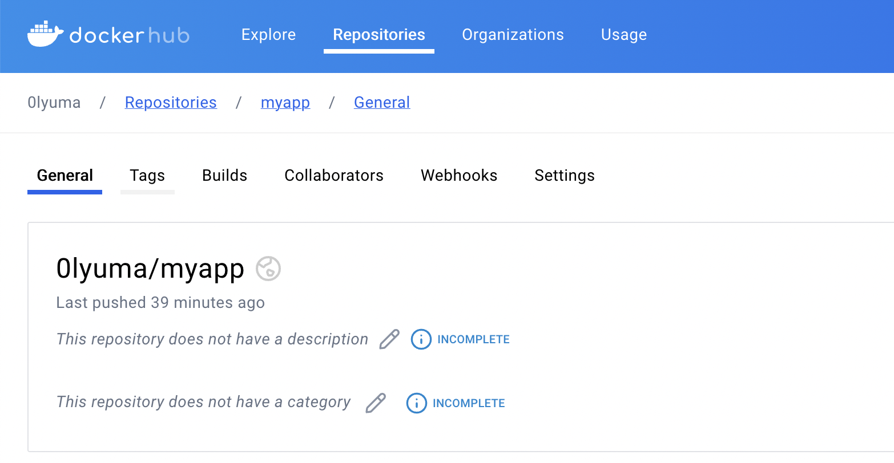
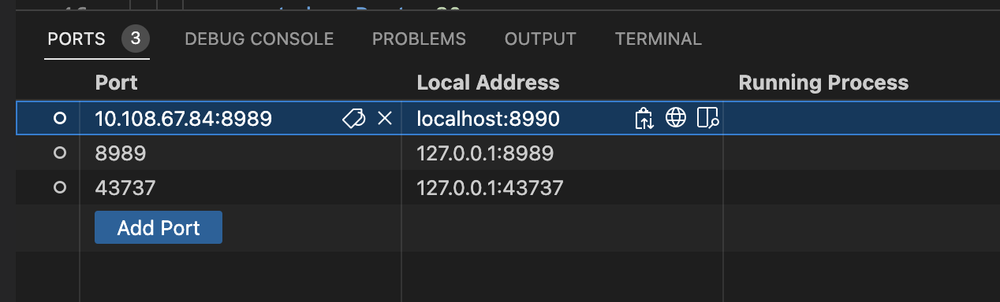

# ☁️ Spring Boot 애플리케이션의 컨테이너화 및 Kubernetes 배포

## 🐳 Dokerfile 작성
```dockerfile
# 베이스 이미지를 선택 (예: OpenJDK 17)
FROM openjdk:17-jdk-slim

# 작업 디렉토리를 설정
WORKDIR /myapp

# JAR 파일을 컨테이너에 복사
COPY build/libs/MyApp-0.0.1-SNAPSHOT.jar /myapp/MyApp-0.0.1-SNAPSHOT.jar

# 컨테이너가 실행될 때 JAR 파일 실행
ENTRYPOINT ["java", "-jar", "/myapp/MyApp-0.0.1-SNAPSHOT.jar"]
```
<br>

## 🐳 Docker Image를 Hub에 올리기
Docker Buildx를 사용하여 멀티 아키텍처 이미지를 생성하는 방법은 여러 플랫폼(예: x86, ARM 등)에서 실행될 수 있는 이미지를 만들 수 있도록 도와줍니다.  
Docker Buildx를 사용하여 멀티 아키텍처 이미지를 생성하는 단계별 방법입니다.

```bash
# Docker Buildx 활성화
docker buildx create --use

# 멀티 아키텍처 이미지 빌드 및 푸시
docker buildx build --platform linux/arm64 -t 0lyuma/myapp --push .
```

**🧐 Docker Buildx를 사용한 이유?**  
M1 Mac 환경에서 Docker Buildx를 사용하는 이유는 기본 빌드 방식으로는 AMD64 아키텍처 이미지만 생성되기 때문입니다.



<br>

## ⛴️ Minikube를 통한 도커 이미지 배포 및 서비스 구성

### 1. Minikube 실행
```bash
minikube start
```

### 2. Deployment 생성
```bash
kubectl create deployment myapp --image=0lyuma/myapp:latest --replicas=3
```
Docker Hub에 있는 0lyuma/myapp:latest 이미지를 사용하여 3개의 파드를 생성합니다.  

### 3. Service 생성
```bash
kubectl expose deployment myapp --type=LoadBalancer --port=8989
```

### 4. Minikube Tunnel 이용
```bash
minikube tunnel
```
Minikube tunnel을 이용해서 외부에서 접근할 수 있도록 설정할 수 있습니다.

### 5. Service 확인


### 6. Port Forwarding

  

Local Address로 접속하여 확인한 결과입니다.

<br>

---

## 🔍 트러블슈팅

### (1) EXTERNAL-IP가 할당되지 않는 이슈
**(문제)**
```bash
ubuntu@servername:~$ kubectl get services
NAME         TYPE           CLUSTER-IP       EXTERNAL-IP   PORT(S)          AGE
kubernetes   ClusterIP      10.96.0.1        <none>        443/TCP          106m
myapp        LoadBalancer   10.106.158.176   <pending>     8080:30898/TCP   23s
```
- Minikube나 로컬 Kubernetes 클러스터에서 클라우드 기반 로드밸런서가 없기 때문에 발생하는 일반적인 현상
- Minikube 같은 로컬 환경에서는 실제 클라우드 환경과 달리 로드밸런서가 자동으로 할당되지 않고 < pending > 현상 발생

**(해결 방법)**  

1. Minikube Tunnel

이미 실행 중인 경우, 진행 중인 터널 프로세스를 찾아 종료한 후 다시 실행해야 합니다.
```bash
# 현재 실행 중인 터널 프로세스 확인
ps aux | grep "minikube tunnel"

# 해당 프로세스 종료
sudo kill -9 <PID>

# 다시 실행
minikube tunnel
```

2. NodePort로 변경
Minikube에서 외부에서 접근하려면 LoadBalancer 대신 NodePort 타입을 사용할 수 있습니다. NodePort는 클러스터 외부에서 접근할 수 있는 고정 포트를 할당합니다.

✔️ 1번 방법을 이용하여 해결하였습니다.

<br>

### (2) Curl IP 명령어 무응답

**(문제)**
`kubectl logs <pod-name>` 실행 결과로 Spring Application 정상적으로 동작하는 것을 확인하였음에도 불구하고 curl로 요청하였을 때 응답이 확인되지 않았습니다.

**(해결 방법)**
Spring Boot 애플리케이션이 포트 8989에서 실행되고 있다면, Kubernetes 서비스의 포트 번호도 8989로 설정해야 합니다.
- Spring Boot 애플리케이션 실행 포트 확인
- Kubernetes 서비시 포트 확인

만약 서비스가 잘못된 포트 번호로 설정되어 있다면, 기존 서비스를 수정할 수 있습니다.  

**수정 방법 1. 명령어로 수정**
```bash
kubectl edit service myapp
```
**수정 방법 2. Dashboard에서 수정**  


서비스가 외부 요청을 받아서 Pod 내부의 애플리케이션으로 올바르게 전달되도록 하기 위해서 yml 파일 내 port와 targetPort 둘 다 수정해주어야 합니다.

```yml
apiVersion: v1
kind: Service
metadata:
  creationTimestamp: "2024-10-02T02:41:25Z"
  labels:
    app: myapp
  name: myapp
  namespace: default
  resourceVersion: "7982"
  uid: 1c6a1b52-ebe3-4513-8215-bcf6080dab84
spec:
  allocateLoadBalancerNodePorts: true
  clusterIP: 10.108.67.84
  clusterIPs:
  - 10.108.67.84
  externalTrafficPolicy: Cluster
  internalTrafficPolicy: Cluster
  ipFamilies:
  - IPv4
  ipFamilyPolicy: SingleStack
  ports:
  - nodePort: 32436
    port: 8989 # 포트 수정 필요
    protocol: TCP
    targetPort: 8989 # 포트 수정 필요
  selector:
    app: myapp
  sessionAffinity: None
  type: LoadBalancer
status:
  loadBalancer:
    ingress:
    - ip: 10.108.67.84
      ipMode: VIP
```

**Port**
- 클러스터 외부 또는 내부에서 서비스가 노출되는 포트
- 서비스가 외부에서 접근될 때 사용하는 포트

**TargetPort**
- Pod에서 실제로 애플리케이션이 실행 중인 포트
- 서비스가 Pod로 트래픽을 전달할 때 사용

**정리**  

애플리케이션이 Spring Boot처럼 특정 포트에서 실행 중일 경우, 요청이 해당 포트로 정확히 전달되도록 targetPort를 수정해야 합니다. 동시에, 외부에서 서비스가 어떤 포트로 노출될지 결정하려면 port도 수정해야 합니다.

<br>

---
## 😉 결론

Docker Hub에 업로드된 이미지를 Minikube 환경에서 쉽게 pull하여 Kubernetes 클러스터에 배포할 수 있었습니다. 이를 통해 Kubernetes를 사용한 애플리케이션 배포가 간편하며, 컨테이너화된 애플리케이션을 손쉽게 관리할 수 있음을 배웠습니다.
