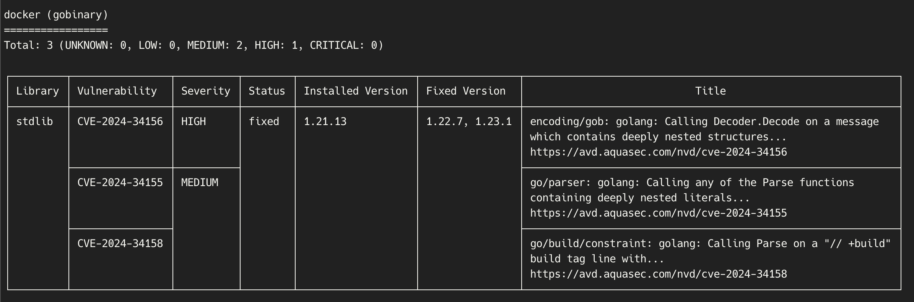
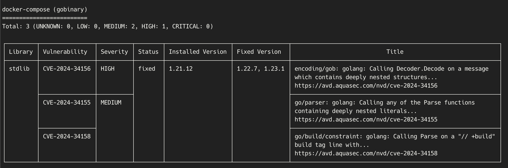
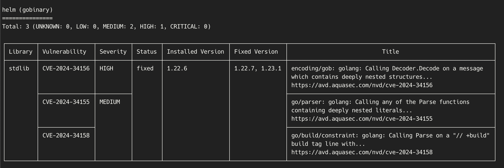
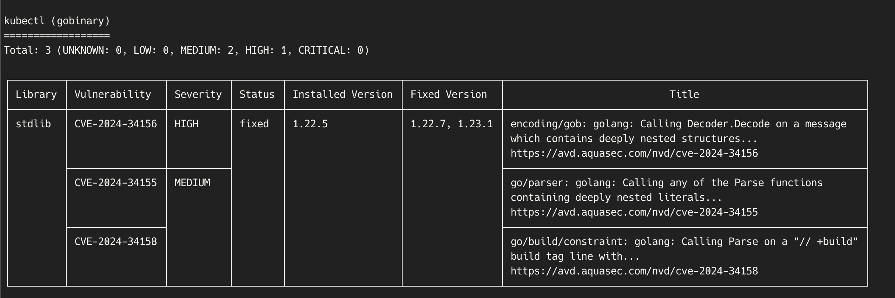
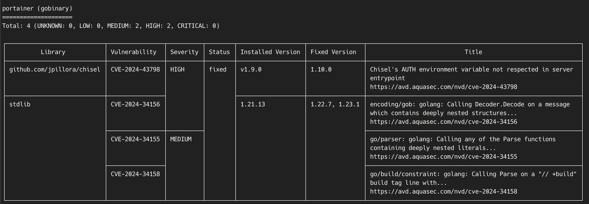

# 📇 Trivy
신뢰성이 높고 빠르며 사용이 간편한 보안 스캐너입니다. 다양한 스캐너를 제공하며, 각각의 스캐너는 다양한 보안 문제를 탐지하는 역할을 합니다. 또한 여러 가지 대상(target)을 스캔하여 보안 문제를 찾아냅니다.

<br>

## Trivy가 탐지하는 보안 문제
<br>

1. 취약점(Vulnerabilities)

- CVE(공개된 취약점): Trivy는 Common Vulnerabilities and Exposures(CVE)로 알려진 공개된 취약점을 탐지합니다. 운영체제 패키지나 소프트웨어 의존성에서 발생하는 보안 결함을 의미합니다.

- SBOM(Software Bill of Materials): Trivy는 소프트웨어 자재명세서를 통해 현재 사용 중인 운영체제 패키지와 소프트웨어 의존성을 스캔하여 해당 구성 요소에 존재하는 취약점을 감지합니다.

2. 구성 오류(Misconfigurations)

- IaC(Infrastructure as Code) 구성 오류: IaC는 인프라를 코드로 정의하는 방식으로, Trivy는 이 IaC에 존재할 수 있는 보안 구성 오류를 탐지합니다. 잘못된 보안 설정은 데이터 유출이나 해킹으로 이어질 수 있는 위험을 초래할 수 있습니다.
- 민감 정보 및 비밀 키 노출: Trivy는 소스 코드나 설정 파일에서 하드코딩된 비밀 키, 토큰, 비밀번호 등의 민감한 정보를 감지합니다. 이러한 정보가 외부에 노출되면 큰 보안 위협이 될 수 있기 때문에, Trivy는 이를 빠르게 탐지해 알려줍니다.  

<br>

## Trivy 사용 방법

### 💻 로컬에 설치

<br>

```bash
# 설치
apt-get install trivy

# 실행
trivy image <이미지명>
trivy filesystem /경로
```

| **장점**        | **단점**            |
|-----------------|---------------------|
| 빠른 실행       | 환경 의존성          |
| 커스터마이즈 기능 | 관리 부담           |
| 네트워크 효율성 |                     |
<br>

### 🐳 Docker에서 실행

Trivy가 설치된 Docker 이미지를 사용하기 때문에 로컬에 추가 라이브러리 설치가 필요 없습니다.
<br>

```bash
docker run --rm -v /var/run/docker.sock:/var/run/docker.sock aquasec/trivy image <이미지명>
```

| **장점**        | **단점**            |
|-----------------|---------------------|
| 환경 독립성     | 퍼포먼스 오버헤드    |
| 빠른 배포       | 네트워크 필요        |
| 간편한 업데이트 | 추가 의존성          |
<br>

## Trivy가 스캔할 수 있는 대상

1. Docker Container Images
2. FileSystem
3. Rootfs: Linux나 Unix 계열 운영체제에서 사용하는 기본 파일 시스템
4. Git Repositories
5. Kubernetes

<br>

이 중에서 파일을 스캔하는 실습을 진행하였습니다.

<br>

Dockerfile을 다음과 같이 구성하였습니다.
```dockerfile
FROM openjdk:17
COPY . /usr/src/myapp
WORKDIR /usr/src/myapp
RUN javac Test.java
CMD ["java", "Test"]
```

`Test.java` 파일 실행 시 "Hello, World!"를 출력합니다.
```java
public class Test {
    public static void main(String[] args) {
        System.out.println("Hello, World!");
    }
}
```

<br>

도커 이미지로 빌드하였습니다.
```bash
docker build -t trivytest .
```

만든 도커 이미지를 실행시켜 보았습니다.
```bash
ubuntu@servername:~/trivy-docker$ docker run trivytest
Hello, World! Welcome to the Becoming DevOps guide
```

해당 도커 이미지에 Trivy를 실행시켰습니다.
```bash
sudo docker run --name trivytest -v /var/run/docker.sock:/var/run/docker.sock aquasec/trivy image trivytest
```

<br>

## Trivy를 이용한 Docker Image Scan

### 1️⃣ Docker Image 조회

Docker에는 다음과 같은 이미지를 가지고 있습니다.
```bash
ubuntu@servername:/$ docker images
REPOSITORY               TAG       IMAGE ID       CREATED        SIZE
0lyuma/trivytest         1.0       a211fdcb5b7e   3 hours ago    501MB
trivytest                latest    a211fdcb5b7e   3 hours ago    501MB
0lyuma/myimg             1.0       20e6d843bedb   24 hours ago   501MB
portainer/portainer-ce   latest    20f60e165534   33 hours ago   293MB
aquasec/trivy            latest    2b878f59d79f   7 days ago     146MB
alpine                   latest    c157a85ed455   2 weeks ago    8.83MB
nginx                    latest    195245f0c792   5 weeks ago    193MB
openjdk                  17        4717374ea615   2 years ago    501MB
```
<br>

### 2️⃣ Trivy 실행
해당 명령어를 이용하여 Docker에 있는 모든 이미지에 대해 Trivy를 실행하였습니다.

<br>

```bash
docker images -q | xargs -I {} sudo docker run --rm -v /var/run/docker.sock:/var/run/docker.sock aquasec/trivy image {}
```
<br>

### 3️⃣ Scan 결과 및 분석

**취약점 1.** docker 


**취약점 2.** docker-compose


**취약점 3.** helm


**취약점 4.** kubectl


🚨 __CVE-2024-34156 (HIGH Severity)__  
Go의 encoding/gob 패키지에서 발견된 취약점으로, 깊이 중첩된 구조체가 포함된 메시지를 Decoder.Decode에 전달할 때 발생합니다. 이로 인해 공격자가 악의적인 데이터를 통해 시스템에 피해를 줄 수 있는 가능성이 존재합니다.  
<br>

❗️ __CVE-2024-34155 (MEDIUM Severity)__  
Go의 go/parser 패키지에서 발생하는 취약점으로, 깊이 중첩된 리터럴을 포함하는 Parse 함수 호출 시 문제가 발생합니다. 이는 구문 분석 과정에서 예기치 않은 동작을 초래할 수 있습니다.  
<br>

🟡 __CVE-2024-34158__  
Go의 go/build/constraint 패키지에서 “// +build” 빌드 태그 라인에서 Parse 호출 시 발생하는 취약점입니다. 이 취약점에 대한 세부 정보는 확인이 필요합니다.  
<br>

**취약점 5.** portainer


🚨 __CVE-2024-43798 (HIGH Severity)__  
이 취약점은 Chisel에서 발견된 문제로, 서버 엔트리포인트에서 AUTH 환경 변수를 제대로 적용하지 못하는 취약점입니다. 공격자가 이 취약점을 이용해 인증 없이 서버에 접근할 가능성이 있습니다.  
<br>