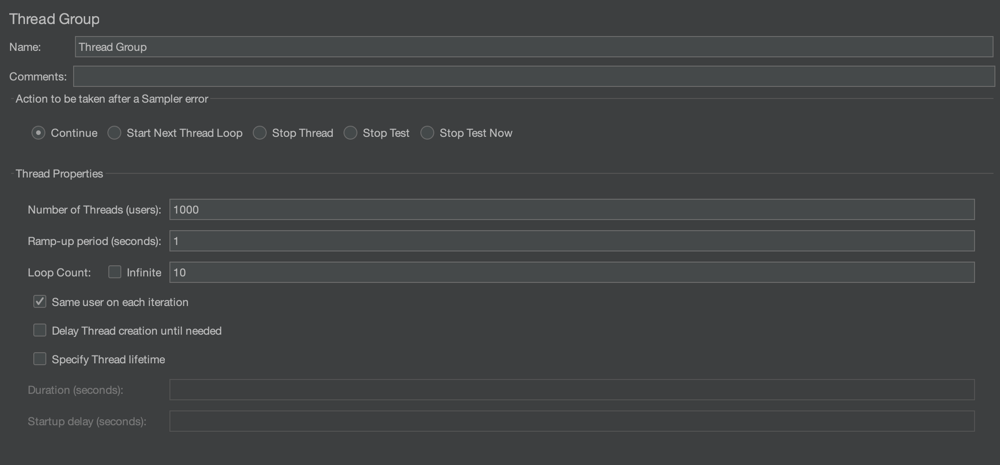
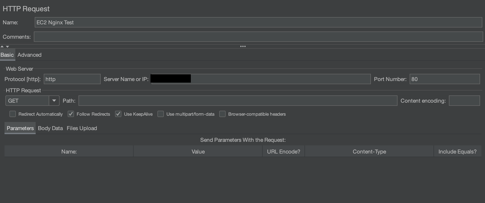
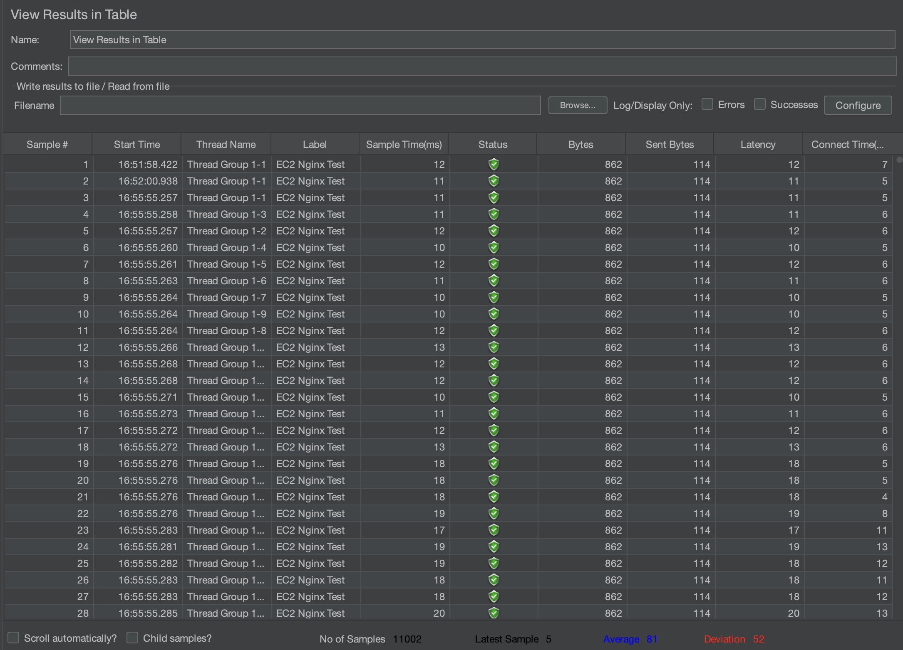
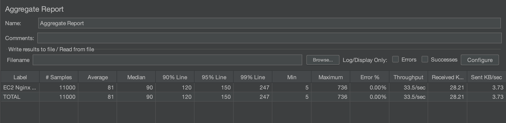

# 📊 Nginx 서버 부하 테스트

## 🧐 개요
---
Nginx 서버의 현재 성능과 한계를 평가하고, 서버 최적화를 위한 환경을 파악하였습니다. 동시 요청 수와 총 요청 수를 점진적으로 증가시키면서 성능 저하나 장애 발생 시점을 확인했으며, 이를 통해 서버의 처리 능력을 향상 시킬 수 있는 방안을 도출할 수 있었습니다.

<br>

## 💡 시스템 자원의 부하 테스트
---

```bash
# stress 도구 설치
sudo apt-get install stress

# CPU 부하 테스트
stress --cpu 4 --timeout 60

# 메모리 부하 테스트
stress --vm 2 --vm-bytes 512M --timeout 60

# 디스크 I/O 테스트
# (1) 쓰기 속도 테스트
dd if=/dev/zero of=./testfile bs=1G count=1 oflag=dsync
# (2) 읽기 속도 테스트
dd if=./testfile of=/dev/null bs=1G count=1

# network stress 도구 설치
sudo apt-get install iperf3

# 네트워크 부하 테스트
iperf3 -s
iperf3 -c <서버_IP> -t 60

```

<br>

## 💡 Apache Benchmark (ab) 를 이용한 부하 테스트
---
MySQL과 함께 웹 서버(Nginx, Apache 등)와 연동하여 HTTP 요청을 통해 부하를 주는 방법입니다.
```bash
sudo apt install apache2-utils
```

부하 테스트 명령어 수행
```bash
ab -n 1000 -c 10 <ip>
```
- -n: 총 요청 수
- -c: 동시 요청 수


결과
```bash
Concurrency Level:      10
Time taken for tests:   0.582 seconds
Complete requests:      1000
Failed requests:        0
Total transferred:      857000 bytes
HTML transferred:       615000 bytes
Requests per second:    1718.47 [#/sec] (mean)
Time per request:       5.819 [ms] (mean)
Time per request:       0.582 [ms] (mean, across all concurrent requests)
Transfer rate:          1438.21 [Kbytes/sec] received
```
- Concurrency Level: 동시 요청 수
- Time taken for tests: 테스트에 소요된 시간
- Complete requests: 완료된 요청 수
- Failed requests: 실패한 요청 수
- Requests per second: 초당 요청 수
- Time per request: 요청당 소요 시간 (평균)
- Transfer rate: 전송 속도

<br>

## 💡 Sysbench 도구 사용
---
Sysbench는 MySQL 데이터베이스의 성능을 측정하고 부하를 생성하는 데 널리 사용되는 도구입니다.
```bash
# 설치
sudo apt install sysbench

# sysbench를 사용하여 테이블 생성 및 데이터 삽입
sysbench /usr/share/sysbench/oltp_insert.lua --db-driver=mysql --mysql-db=sbtest --mysql-user=root --mysql-password=<your_password> prepare

# 읽기 및 쓰기 부하 테스트
sysbench /usr/share/sysbench/oltp_read_write.lua --db-driver=mysql --mysql-db=sbtest --mysql-user=root --mysql-password=<your_password> --tables=1 --table-size=10000 --threads=10 --time=60 run
```
- --threads: 사용할 스레드 수
- --time: 테스트 실행 시간 (초)
- --table-size: 각 테이블에 저장할 행의 수

테스트가 완료되면 sysbench는 TPS(Transactions Per Second), Latency, Error Rate 등의 성능 지표를 제공합니다.

예시 결과
```bash
total time:                          60.0000s
total number of events:              1000
latency:
     min:                                    2.1234ms
     max:                                   40.5678ms
     avg:                                    5.5678ms
     95th percentile:                        7.1234ms
     sum:                                 567.8910ms
```

<br>

## 💡 Jmeter 사용
---
Apache JMeter는 웹 애플리케이션의 성능을 테스트하는 데 사용되는 강력한 도구입니다.

### ⚙️ Jmeter 구성 요소

**1. Test Plan**
- JMeter에서 테스트를 구성하는 최상위 요소
- 테스트의 전체적인 흐름 제어
- 테스트에 필요한 모든 설정, 요소 및 샘플러들 포함

**2. Thread Group**
- JMeter에서 사용자를 시뮬레이션하는 역할
- 몇 개의 쓰레드가 동시에 요청을 보내는 지

**3. Sampler**
- Thread Group이 실제로 실행하는 요청을 정의

**4. Logic Controller**
- 테스트 계획의 실행 흐름을 제어
- 복잡한 테스트 흐름 설계 가능

**5. Listener**
- JMeter 테스트의 결과를 수집하고 시각화
- 응답을 받았을 때 다양한 결과를 그래프, 표, 로그 형식으로 표현

<br>

### 📃 JMeter를 이용한 테스트 절차

**1. 테스트 계획 수립**  

JMeter에서 어떤 URL을 테스트할지, 몇 명의 사용자를 시뮬레이션할지, 테스트의 반복 횟수 등 실행할 테스트의 전체 구조를 설정합니다.

**2. Thread Group 설정**  

사용자를 시뮬레이션하는 구성 요소로, 사용자 수와 실행 시간, 반복 횟수 등을 설정합니다. 이 설정을 통해 부하의 크기를 조절합니다.



**3. HTTP 요청 샘플러 구성**  
각 사용자가 서버로 보내는 요청을 구성하는 부분으로, 이 샘플러를 통해 JMeter는 설정된 URL로 HTTP 요청을 보냅니다.



**4. 리스너 구성**
리스너는 테스트 결과를 시각화하는 도구입니다. 대표적인 리스너로는 Aggregate Report, View Results Tree 등이 있습니다.


View Results Tree 결과입니다.


Aggregate Report 결과입니다.

<br>

**✨ 결과 정리 ✨**  

해당 테스트는 1000명의 사용자가 1초 동안 동시에 서버에 부하를 걸었고, 각 사용자가 10회 요청을 보낸 상황입니다. 이를 바탕으로 Aggregate Report에서 나온 값들을 분석하겠습니다. 응답 시간 분포를 확인해보면 평균 응답 시간(81ms)은 양호한 편이지만, 최대 응답 시간(736ms)이 큰 차이를 보입니다. 이는 시스템이 급격한 트래픽 변화에 적응하지 못하거나, 일부 요청이 병목 현상을 겪었을 가능성을 나타냅니다.  

긴 응답 시간이 서버의 자원 한계에 도달했을 때 발생하는 것인지, 특정 요청이 원인인지 추가 분석이 필요합니다. Ramp-Up 시간을 늘려서 점진적으로 사용자를 증가시키는 방법을 통해, 서버가 안정적으로 부하를 처리할 수 있도록 테스트를 다시 시도해볼 예정입니다.