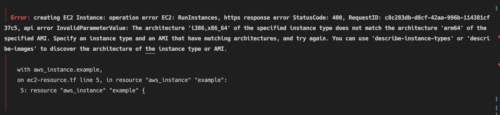

# 🔎 Terraform 이용하여 AWS S3와 EC2 생성하기

## 01. Terraform 설치

```bash
# Root 계정으로 이동해서 작업 진행
sudo -i # sudo su -

wget -O- https://apt.releases.hashicorp.com/gpg | sudo gpg --dearmor -o /usr/share/keyrings/hashicorp-archive-keyring.gpg

echo "deb [signed-by=/usr/share/keyrings/hashicorp-archive-keyring.gpg] https://apt.releases.hashicorp.com $(lsb_release -cs) main" | sudo tee /etc/apt/sources.list.d/hashicorp.list

sudo apt-get update
sudo apt-get install terraform -y

terraform -version
```

<br>

## 02. Terraform 이용해서 S3 버킷 생성

### ✅ 권한 관련 설정 파일
**provider.tf**
```HCL
# IAM 역할 생성
resource "aws_iam_role" "s3_create_bucket_role" {
  name = "s3-create-bucket-role"
  
  assume_role_policy = jsonencode({
    "Version": "2012-10-17",
    "Statement": [
      {
        "Action": "sts:AssumeRole",
        "Effect": "Allow",
        "Principal": {
          "Service": "ec2.amazonaws.com"
        }
      }
    ]
  })
}

# IAM 정책 정의
resource "aws_iam_policy" "s3_full_access_policy" {
  name        = "s3-full-access-policy"
  description = "Full access to S3 resources"
  
  policy = jsonencode({
    Version = "2012-10-17"
    Statement = [
      {
        Effect = "Allow"
        Action = [
          "s3:*"  # 모든 S3 액세스 허용
        ]
        Resource = [
          "*"  # 모든 S3 리소스에 대한 권한
        ]
      }
    ]
  })
}

# IAM 역할에 정책 연결
resource "aws_iam_role_policy_attachment" "attach_s3_policy" {
  role       = aws_iam_role.s3_create_bucket_role.name
  policy_arn = aws_iam_policy.s3_full_access_policy.arn
}
```
S3 버킷을 사용할 수 있도록 권한을 부여하는 설정을 하였습니다. 버킷을 만들 수 있도록 IAM 역할을 생성하고 S3에 대한 모든 권한을 부여할 수 있도록 IAM 정책을 정의하였습니다. 해당 파일은 그룹의 한 사람만 수행해야 합니다.

<br>

### ✅ 버킷 생성
**resource.tf**
```HCL
# S3 버킷 생성
resource "aws_s3_bucket" "bucket1" {
  bucket = "bucket-Name"
}

# S3 버킷의 public access block 설정
resource "aws_s3_bucket_public_access_block" "bucket1_public_access_block" {
  bucket = aws_s3_bucket.bucket1.id

  block_public_acls       = false
  block_public_policy     = false
  ignore_public_acls      = false
  restrict_public_buckets = false
}

# 이미 존재하는 S3 버킷에 index.html 파일을 업로드
resource "aws_s3_object" "index" {
  bucket        = aws_s3_bucket.bucket1.id  # 생성된 S3 버킷 이름 사용
  key           = "index.html"
  source        = "index.html"
  content_type  = "text/html"
}

# S3 버킷의 웹사이트 호스팅 설정
resource "aws_s3_bucket_website_configuration" "xweb_bucket_website" {
  bucket = aws_s3_bucket.bucket1.id  # 생성된 S3 버킷 이름 사용

  index_document {
    suffix = "index.html"
  }
}

# S3 버킷의 public read 정책 설정
resource "aws_s3_bucket_policy" "public_read_access" {
  bucket = aws_s3_bucket.bucket1.id  # 생성된 S3 버킷 이름 사용

  policy = <<EOF
{
  "Version": "2012-10-17",
  "Statement": [
    {
      "Effect": "Allow",
      "Principal": "*",
      "Action": [ "s3:GetObject" ],
      "Resource": [
        "arn:aws:s3:::bucket-Name",
        "arn:aws:s3:::bucket-Name/*"
      ]
    }
  ]
}
EOF
}
```
정적 웹사이트와 통신 가능하게 구성하였습니다. 해당 파일과 같은 디렉토리에 index.html 파일을 생성해줍니다.

<br>

### ✅ Terraform 실행
```HCL
terraform init
```
디렉토리에 있는 모든 Terraform 설정 파일을 초기화하고 필요한 플로그인을 다운로드합니다.

```HCL
terraform plan # 생략 가능
terraform apply
terraform apply -auto-approve # 속성 적용 시 이렇게 중간 확인 단계 생략하고 실행
```
디렉토리에 있는 모든 .tf 파일의 리소소를 분석해서 종합적으로 계획을 세운 후 적용합니다.

**👍 정리**
- 여러 .tf 파일이 있더라도 Terraform은 하나의 모듈처럼 취급합니다. 파일 간 참조가 필요하다면 자동으로 분석합니다.
- 새로운 파일을 추가해도 해당 디렉토리에 있는 모든 파일이 재탐색됩니다. 최근에 추가되거나 수정된 파일만 실행하는 방식은 아닙니다.

**🧐 특정 파일 실행 방법은?**

1. 모듈화
디렉토리(모듈)로 나눠서 리소스나 설정을 필요할 때만 불러올 수 있도록 합니다.

2. target 사용
target 옵션을 사용합니다.
```bash
terraform apply -target=aws_s3_object.upload_html
```

이렇게 하면 지정한 리소스만 업데이트할 수 있지만, 여전히 모든 파일은 읽히게 됩니다.

<br>

## 03. Terraform 이용해서 EC2 생성

### Terraform 설정 파일
```HCL
provider "aws" {
  region = "ap-northeast-2"  # 서울 리전
}

resource "aws_instance" "example" {
  ami           = "ami-003aa746ac2e6a66d" # AMD64 Ubuntu 22.04 AMI
  instance_type = "t2.micro"  # 프리티어 가능 인스턴스
  key_name      = "your-key-name"  # EC2에 사용할 SSH 키 페어 이름

  tags = {
    Name = "Terraform-EC2-Instance"
  }
}
```

해당 설정 파일을 이용하여 인스턴스를 생성하고 아래 명령어를 통해 생성된 인스턴스를 확인할 수 있습니다.
```bash
aws ec2 describe-instances --filters "Name=tag:Name,Values=Terraform-EC2-Instance"
```

추가적으로, 필요에 따라 VPC, 보안 그룹, EBS 볼륨 등 다양한 AWS 리소스를 추가할 수도 있습니다.

<br>

## 04. Terraform 이용해서 존재하는 S3에 파일 추가

```HCL
provider "aws" {
  region = "ap-northeast-2"
}

resource "aws_s3_object" "upload_html" {
  bucket = "bucket-Name"
  key    = "main.html"
  source = "main.html"
  content_type = "text/html"  # MIME 타입 설정
}
```

해당 Terraform을 실행할 시 다음사항들을 확인해줘야 합니다.
- main.html이 같은 디렉토리에 존재하는지
- S3 버킷이 퍼블릭 엑세스 설정을 허용하고 있는지
- 필요한 IAM 권한(s3:PutObject)이 부여된 AWS 자격 증명이 설정되어 있는지

<br>

## 🚨 트러블슈팅

### (1) AMI
실습 환경이 Mac OS이어서 ARM64 Ubuntu를 설치해야겠다고 생각하여 `aws ssm get-parameters --names /aws/service/canonical/ubuntu/server/22.04/stable/current/arm64/hvm/ebs-gp2/ami-id --region ap-northeast-2`  명령어를 실행 시켜서 나온 AMI 아이디를 넣으려고 하였습니다.


하지만, 인스턴스 유형과 AMI 간의 아키텍처 불일치 문제가 발생하였습니다. ARM64 아키텍처용 AMI를 사용하려면 ARM 기반의 인스턴스 유형을 선택해야 하기 때문입니다. t2.micro는 x86_64 아키텍처만 지원하므로 호환되지 않습니다.
```bash
aws ec2 describe-images \
  --owners 099720109477 \
  --filters "Name=name,Values=ubuntu/images/hvm-ssd/ubuntu-jammy-22.04-amd64-server-*" \
  --region ap-northeast-2 \
  --query "Images[*].ImageId" --output text
```
위 명령어 결과 중 하나를 골라서 ami로 설정하였습니다.

<br>

### (2) NoSuchBucket
이미 존재하는 S3 버킷에 파일을 추가할 때 `NoSuchBucket: The specified bucket does not exist` 오류가 발생하였습니다. 이 오류는 Terraform이 S3 버킷을 찾을 수 없을 때 발생하는 것이어서 먼저 버킷 이름을 확인해보고 다음으로는 버킷 생성 순서를 생각해보았습니다.
```bash
Error: uploading S3 Object (index.html) to Bucket (bucket-Name-1): operation error S3: PutObject, https response error StatusCode: 404, RequestID: XGCKRWHD4S6AWHKG, HostID: YsGr0GKdVXnLucYcJGXNdmwNxzY3SQenBrnbIHru0e5A/byfCRfxCJCVKdjscQzKTqtD/xcD4Cs=, api error NoSuchBucket: The specified bucket does not exist
```
버킷이 생성된 후에 객체를 업로드 해야 하기 때문에 `depends_on  = [aws_s3_bucket.bucket1]` 을 사용하여 aws_s3_object가 aws_s3_bucket 리소스에 의존하도록 설정하였습니다.